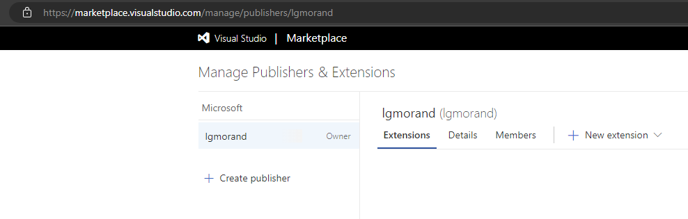
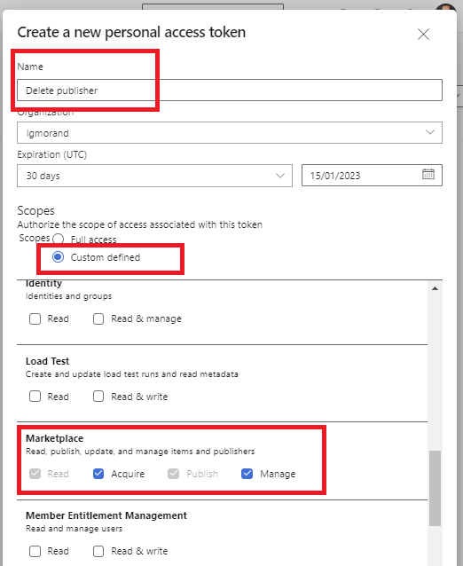
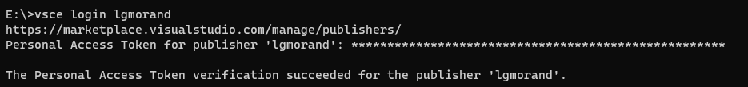

## How to delete a publisher from the Azure DevOps marketplace ?

Long story short, few years ago I created a publisher account on the [Azure DevOps marketplace](https://marketplace.visualstudio.com/) in order to publish all kind of extensions. Today, I needed to unpublish these extensions but also needed to delete the publisher in order to retrieve its identity for another usage.

Sadly, if you can create as many publishers as you want on the Web Portal, there is no way to delete them. You can contact the support but you are not sure how long it will take.



Looking on Internet, you find one person recommending using the tfx-cli:

```bash
tfx extension publisher delete --publisher mypublisherid
```

But that's a dead end because the tool does not support it (not even sure it ever supported it). Anyway, I needed to find something else.

## VSCE, the replacement of tfx-cli ?

I was ready to forfeit and contact the support when another thread on Internet advised to use VSCE. As much as tfx is the tool to manage extensions for Azure DevOps, in order to manage publisher on the marketplace, you need to use another tool: **Visual Code Extension Manager** (VSCE) which can be found [here](https://github.com/microsoft/vscode-vsce). Yeah, the tool name and the link with the Marketplate is not obvious. Anyway, it can installed using a simple command on your system

```bash
npm install --global @vscode/vsce
```

Now that VSCE is installed, let's authenticate against the marketplace.

```bash
vsce login PUBLISHER_NAME
```

But when you run it, it asks for a token to authenticate as the owner of the publisher. To do so, using the account owning the publisher, authenticate on any Azure DevOps organization. From there, create a PAT token with rights over the marketplace.



Copy the PAT token in the terminal to log in the vsce tool.



Once authenticate, you can use the *delete-publisher* command:

```bash
vsce delete-publisher PUBLISHER_NAME
```


And that's it. My publishers are gone and I can now create new ones !
