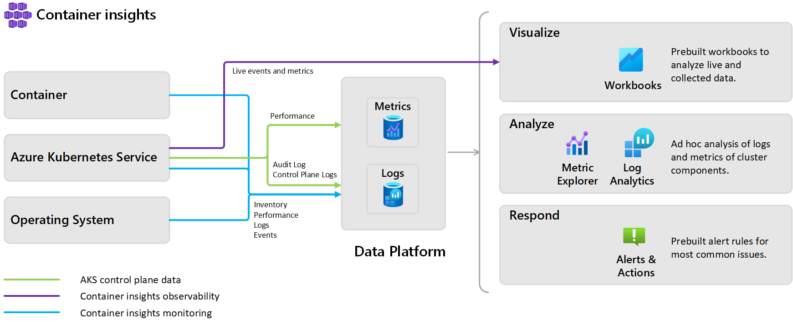
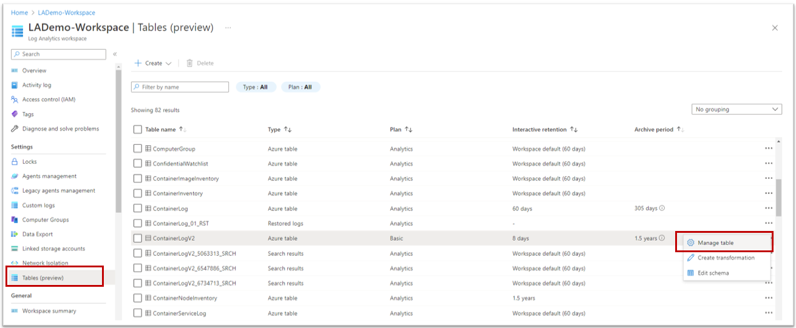
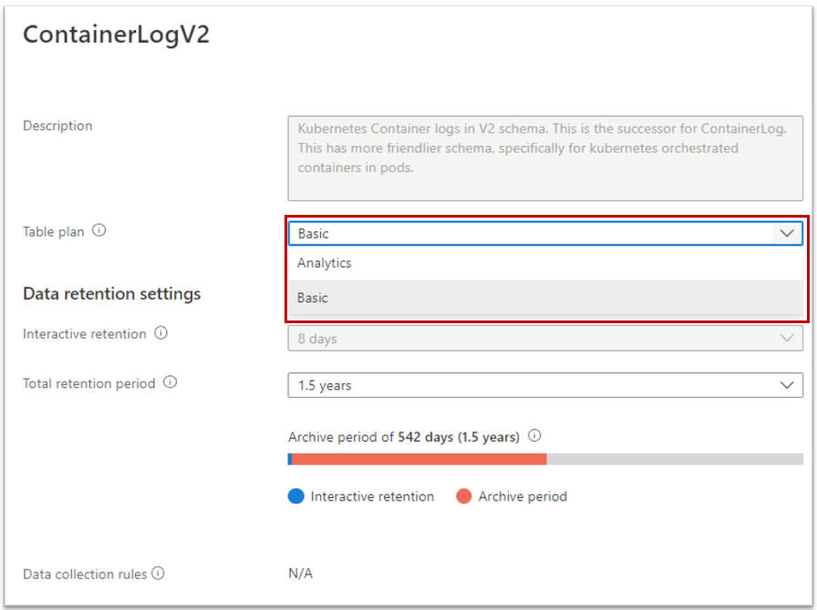
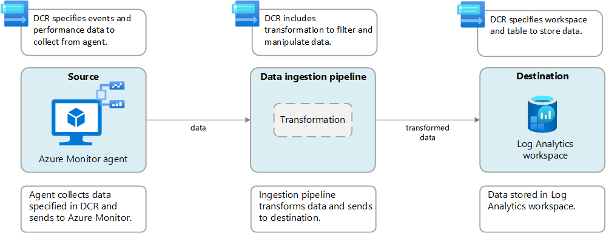
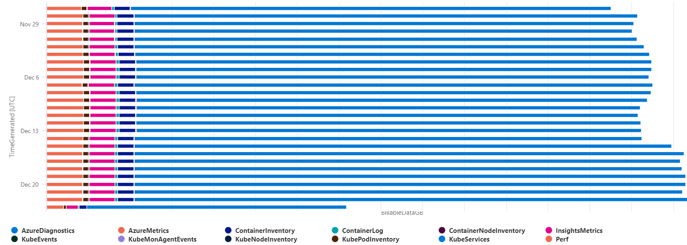

Let's be straight to the point, monitoring is NOT cheap. The more information you collect/need, the **more you'll have to pay either for the processing or the storage of all this data**. If you implement monitoring of your different clusters, you'll discover that it can quickly become expensive. As an example, a small cluster (3 nodes) with few pods [can generate 20 GB of data per month](https://learn.microsoft.com/en-us/azure/azure-monitor/containers/container-insights-cost#estimating-costs-to-monitor-your-aks-cluster).

Let's see how you can optimize your monitoring to reduce drastically the costs.

> This article will only cover the Azure built-in monitoring solution. If you are using alternative monitoring solutions, they are not cheaper either but I can't help.

If you can't make all the costs disappear there are different ways to optimize them.

- [Agent configuration](#agent-configuration)
- [Basic Logs](#basic-logs)
- [Table transformation](#table-transformation)
- [Data Collection Rules](#data-collection-rules)
- [Diagnostics settings](#diagnostics-settings)
- [Log Analytics Commitment tier](#commitment-tier)

> All of these items are unrelated to each other and you can choose the ones which apply to your context.

## Analyzing your data

When you work with Log Analytics you need to understand that the data are stored in tables. The default pricing for Log Analytics is a pay-as-you-go model that's based on ingested data volume and data retention. We will cover different ways to act on these two costs, either by acting on the data itself or the underlying storage.

Depending on which metrics/logs/diag you are capturing in your cluster, you may not be able to apply all the tips listed in this article. You should first start to understand the repartition of your data. You can do it with the following query:

```` sql
Usage 
| where TimeGenerated > startofday(ago(31d))
| where IsBillable == true
| summarize BillableDataGB = sum(Quantity) / 1000. by bin(TimeGenerated, 1d), DataType | render piechart
````

As shown in the chart below we can see that Perf and ContainerInventory are a big part of my logged data. Do you really need all of them? There is no global best practice as each project each different. Choose wisely which optimization you can leverage.


## Agent configuration

Normally, when you want to monitor an AKS cluster, you start with the built-in solution [Azure Containers Insights](https://learn.microsoft.com/en-us/azure/azure-monitor/containers/container-insights-overview) which allows, in just one click, to grab all kinds of logs & metrics from your cluster.



Behind the scenes, when you enable Container Insights and choose a target Log Analytics to receive data, it deploys different components within your cluster. These components are part of a containerized version of the Azure Monitor Agent.


This agent (AMA) which is a replacement for the old one (called OMS Agent) has the same default behavior: grabbing cluster metrics and workloads logs.

Lucky for us, we can customize the behavior by editing the [configMap template](https://raw.githubusercontent.com/microsoft/Docker-Provider/ci_prod/kubernetes/container-azm-ms-agentconfig.yaml).

Some ideas to reduce data exported:

- disabling verbose logs: `[log_collection_settings.stdout]`
- disabling env variables: `[log_collection_settings.env_var]`
- exclude system to grab error logs: `[log_collection_settings.stdout].exclude_namespaces`
- if Prometheus metrics are enabled, exclude non-useful namespaces/resources `[prometheus_data_collection_settings.cluster]`

> Options to customize are limited but we'll see later, additional ways to customize the agent behavior.

Once you have finished editing it, upload the manifest in the cluster. (you must restart the AMA pods for changes to apply and it can take a few minutes to appear in Log Analytics).

## Basic Logs

Azure Monitor offers two log data plans that let you reduce log ingestion and retention costs and take advantage of Azure Monitor's advanced features and analytics capabilities based on your needs:

- The default Analytics log data plan provides full analysis capabilities and makes log data available for queries, Azure Monitor features, such as alerts, and use by other services.
- The **Basic log** data plan lets you save on the cost of ingesting and storing high-volume verbose logs in your Log Analytics workspace for debugging, troubleshooting, and auditing, but not for analytics and alerts.

| Category | Analytics | Basic |
|---|---|---|
| Ingestion | Regular ingestion cost. | Reduced ingestion cost.|
| Log queries | Full query capabilities. No extra cost | Basic query capabilities. Pay-per-use. |
| Retention |Configure retention from 30 days to two years. Retention fixed at eight days. | When you change an existing table's plan to Basic logs, Azure archives data that's more than eight days old but still within the table's original retention period. |
| Alerts | Supported. | Not supported |

To switch to Basic Logs, you must open your Log Analytics and go to the `Tables` blade. From there, edit the desired table and choose the Basic plan.





> Not all tables are compatible with Basic Logs. AKS is storing data in different tables but only the table ContainerLogV2 is compatible with this feature. This table is **not enabled** by default, [you must activate it](https://learn.microsoft.com/en-us/azure/azure-monitor/containers/container-insights-logging-v2).

In terms of pricing, you should expect to [lower the price of the logs (the ones containers ContainerLogV2) by 75%](https://azure.microsoft.com/en-us/pricing/details/monitor/).

For more detailed information, you can [read the documentation](https://learn.microsoft.com/en-us/azure/azure-monitor/logs/basic-logs-configure).

## Table transformation

When data are sent (from any agent/source) to Azure Log Analytics, you can act on the data before there are ingested. This feature is generally useful for three scenarios:

- Remove sensitive data
- Enriching the data (i.e. adding calculating columns, rewriting data format)
- Filtering the data



We are interested in the third one because we can use it to either reduce the number of rows or remove some column that contains irrelevant data.

Open your Log Analytics, select the table you want to filter data, and click on `Edit transformation`:


Then follow the wizard to exit the default query


> Note: Table transformation can also be used to split data and send them in different tables, for instance an table on which you can enable BasicLogs. Right now, it can not be done through the portal, you must use ARM templates to do so. Remember that table transformation is not [available for all tables](https://learn.microsoft.com/en-us/azure/azure-monitor/logs/tables-feature-support).

Your query can become quite complex but it could drastically reduce the number of imported data.

Regarding the pricing, be aware that even if you remove a big chunk of data, [you'll pay for a part of the removed data](https://learn.microsoft.com/en-us/azure/azure-monitor/essentials/data-collection-transformations#cost-for-transformations).
Typically, if you have 100Gb of data and filter 70% of it (it remains 30Gb), you will pay:

- 20Gb of [data processing with a specific formula](https://learn.microsoft.com/en-us/azure/azure-monitor/essentials/data-collection-transformations#cost-for-transformations)
- 30Gb of data ingestion

The price per Gb is not the same for the two! Data processing is 5x cheaper. Nevertheless, if you can reduce data even before they are sent to Log Analytics (with the [Agent configuration](#agent-configuration) or the [next chapter](#data-collection-rules)), it would be better.

For more information regarding Table Transformation, [read the documentation](https://learn.microsoft.com/en-us/azure/azure-monitor/essentials/data-collection-transformations).

## Data Collection Rules

A new feature announced a few days ago is the usage of [Data Collection Rules](https://review.learn.microsoft.com/en-us/azure/azure-monitor/essentials/data-collection-rule-overview). Called, `Cost optimization settings`, it offers users the ability to customize and control the metrics data collected through the Container Insights agent. It allows customers to configure custom collection settings for the Perf, Inventory, InsightsMetrics, and KubeEvents tables to reduce their Log Analytics ingestion.

You have three new parameters:

| Data collection setting | Allowed Values | Description |
|---|---|---|
interval|[1m, 30m] in 1m intervals|This value determines how often data is collected. The default value is 1m, where m denotes the minutes. If the value is outside the allowed range, then default value is set to be 1m (i.e., 60 seconds).
namespaceFilteringMode|Include, Exclude, or Off|Choosing Include collects only data from the values in the namespaces field. Choosing Exclude collects data from all namespaces except for the values in the namespaces field. Off will ignore any namespace selections and collect data on all namespaces.
namespaces|An array of names i.e. ["kube-system", "default"]|Array of comma separated Kubernetes namespaces for which inventory and perf data will be included or excluded based on the namespaceFilteringMode. For example, namespaces = ["kube-system", "default"] with an Include setting will collect only these two namespaces. With an Exclude setting, the agent will collect data from all other namespaces except for kube-system and default. With an Off setting, the agent will collect data from all namespaces including kube-system and default. Invalid and unrecognized namespaces will be ignored.

| ContainerInsights Table Name | Is Data collection setting: interval applicable? | Is Data collection setting: namespaces applicable? | Remarks
|---|---|---|---|
| ContainerInventory | Yes | Yes |
| ContainerNodeInventory | Yes | No | Data collection setting for namespaces is not applicable since Kubernetes Node is not a namespace scoped resource
| KubeNodeInventory | Yes | No | Data collection setting namespaces is not applicable Kubernetes Node is not a namespace scoped resource
| KubePodInventory | Yes | Yes |
| KubePVInventory | Yes | Yes |
| KubeServices | Yes | Yes |
| KubeEvents | No | Yes | Data collection setting interval is not applicable for the Kubernetes Events |
| Perf | Yes | Yes* | *Data collection setting namespaces is not applicable for the Kubernetes Node related metrics since the Kubernetes Node is not a namespace scoped object. |
| InsightsMetrics | Yes** | Yes** | **Data collection settings are only applicable for the metrics which collected with following namespaces: container.azm.ms/kubestate, container.azm.ms/pv and container.azm.ms/gpu |

Once you decided what are your desired parameters, you just need to create a small JSON file:

```json
{
  "interval": "1m",
  "namespaceFilteringMode": "Include",
  "namespaces": ["kube-system"]
}
```

> Warning: Editing the interval may have an impact on existing alerts and visualizations. If you are currently using the metrics tables for charts or alerts, then modifying your data collection settings may degrade those experiences if you are excluding namespaces or reducing data collection frequency. Please review your existing alerts, dashboards, and workbooks using this data.

Then you must apply this configuration DCR to the cluster.

For a new cluster:

```azcli
az aks create -g myResourceGroup -n myAKSCluster --enable-managed-identity --node-count 1 --enable-addons monitoring --enable-msi-auth-for-monitoring --data-collection-settings myjsonfile.json --generate-ssh-keys
```

For an existing cluster:

```azcli
# obtain the configured log analytics workspace resource id
az aks show -g <clusterResourceGroup> -n <clusterName> | grep -i "logAnalyticsWorkspaceResourceID"

# disable monitoring 
az aks disable-addons -a monitoring -g <clusterResourceGroup> -n <clusterName>

# enable monitoring with data collection settings
az aks enable-addons -a monitoring --enable-msi-auth-for-monitoring -g <clusterResourceGroup> -n <clusterName> --workspace-resource-id <logAnalyticsWorkspaceResourceId> --data-collection-settings myjsonfile.json
```

And that's it.

Behind the scene, it creates a DCR rule, which you can find by opening `Monitor` (left part of Azure Portal), then `Data Collection Rules`. You will find a rule named after your cluster which contains the configuration for the agent (you need to click on `JSON View` in the overview)


## Diagnostics settings

As explained [in this article](https://learn.microsoft.com/en-us/azure/azure-monitor/essentials/diagnostic-settings?tabs=portal), *diagnostics settings* are platform logs & metrics which are grabbed automatically by Azure but not stored by default (but still viewable in the "Metrics" panel, even if monitoring is disabled). They bring information that is not present in ContainerInsights or Prometheus, including logs of the different APIs of Kubernetes.

These diagnostics are critical. Standard monitoring or Microsoft won't store these logs and if you need any compliance audit to know which command was sent to your cluster, you **must** enable some of these diagnostics.

Sadly, these diagnostics can be very expensive and you won't probably do analytics and alerts on them.



If that's the case, prefer to export them to a (cold) storage account which will be way cheaper and will allow you to keep them for a long period.

## Commitment tier

The last part is critical because once you have optimized the costs by controlling the data, you now have an idea of the quantity of data you'll ingest per month.
From there, you can commit on the consumption and [get an additional discount](https://learn.microsoft.com/en-gb/azure/azure-monitor/logs/cost-logs#commitment-tiers).

Be careful, the commitment is made per workspace which means it may be interesting to reduce the number of workspaces and mutualize them. Beyond cost benefits, it will interesting to correlate data within a single workspace

## Clean useless resources

Inside the more resources get present, the more you'll get data from them. A good example is completed jobs. These completed pods remain in the Kubernetes cluster and need to be cleaned up manually from time to time. These completed pods are also monitored by Azure Monitor for Containers periodically, which might add to costs.

## Conclusion

All these tweaks won't allow you to get a free monitoring solution but they should help to fine-tune your usage and to pay only for what you need. From my personal experience, I'd say that I was always capable to lower the price from 50% to 80% combining several of these tips.
