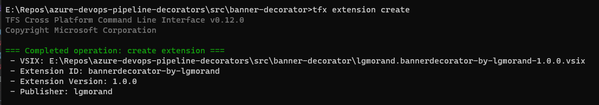

This subject is split into five parts:

- Part 1: [What are pipeline decorators and create your first decorator](https://lgmorand.github.io/blog/azure-devops-pipeline-decorator-part1)
- Part 2: [Deploy your decorator, validate it, and enhance it](https://lgmorand.github.io/blog/azure-devops-pipeline-decorator-part2)
- Part 3: [Create a more advanced decorator: a docker linter](https://lgmorand.github.io/blog/azure-devops-pipeline-decorator-part3)
- Part 4: [Create another advanced decorator: a credentials scanner](https://lgmorand.github.io/blog/azure-devops-pipeline-decorator-part4)
- Part 5: [Tips and tricks](https://lgmorand.github.io/blog/azure-devops-pipeline-decorator-part4)

## Part 1: Our first decorator

### What are pipeline decorators?

Pipeline decorators are [custom tasks](https://learn.microsoft.com/en-us/azure/devops/extend/develop/add-build-task) (build or release) which can be injected automatically in all workflows of an Azure DevOps organization without the consent of the creators of the different pipelines. In a perfect world, within an organization, each development team is responsible to build their pipelines and ensure they follow the company's common good practices. In some cases, to help them, a team (often the one owning the Azure DevOps organization) creates custom tasks and make them available to users to enrich their pipelines. It could be a wrapper to build something complex or to call a tool such as a SCA/SAST (security code analyzer).

The issue with this approach is that you can't ensure that users will add the required tasks to their pipelines, and they could easily bypass quality processes you are trying to set up during development lifecycle. That's where the pipeline decorators are the solution.

### Requirements

To follow this guide and be able to create pipeline decorators and deploy them, you will require several things:

- An Azure DevOps organization where you are administrator (you can [create one for free](https://learn.microsoft.com/en-us/azure/devops/organizations/accounts/create-organization))
- A publisher account on the Azure DevOps marketplace
- [TFX CLI](https://www.npmjs.com/package/tfx-cli), which requires [NodeJS](https://nodejs.org) to be installed on your machine
- (Optional) [Visual Code Extension Manager](https://github.com/microsoft/vscode-vsce) (VSCE)

### Create our first decorator

We are going to start with a quite elemantary example. In this "hello world" example, we are going to see how to inject a simple task in all workflows of our organization to see the concept of build and deploying a pipeline decorator. Later, we will see how to leverage the customization of these decorators and then create more complex decorators.

Create a folder and name it banner-decorator and create two files: *vss-extension.json* and *banner-decorator.yml*. The structure should look like this:

```bash
| banner-decorator
| -- vss-extension.json
| -- banner-decorator.yml
```

We need to declare the actions which will be performed by our decorator, for instance, we could name it *banner-decorator.yml*. The format is the same as for YAML pipelines, where you can add different steps. In our first decorator, we will add only one step to display a message in the pipeline's logs.

```yaml
steps:
  - task: CmdLine@2
    displayName: '(Injected) Here is my super banner'
    inputs:
      script: |
        echo "This step is automatically injected in your workflow as part of the governance of the company"
        
        echo "_______  _        _        _______ "
        echo "|\     /|(  ____ \( \      ( \      (  ___  )"
        echo "| )   ( || (    \/| (      | (      | (   ) |"
        echo "| (___) || (__    | |      | |      | |   | |"
        echo "|  ___  ||  __)   | |      | |      | |   | |"
        echo "| (   ) || (      | |      | |      | |   | |"
        echo "| )   ( || (____/\| (____/\| (____/\| (___) |"
        echo "|/     \|(_______/(_______/(_______/(_______)"
        echo " "
        echo " _______                    _______  _ "
        echo "(  ____ \|\     /||\     /|(  ____ \( )"
        echo "| (    \/| )   ( |( \   / )| (    \/| |"
        echo "| |      | |   | | \ (_) / | (_____ | |"
        echo "| | ____ | |   | |  \   /  (_____  )| |"
        echo "| | \_  )| |   | |   ) (         ) |(_)"
        echo "| (___) || (___) |   | |   /\____) | _ "
        echo "(_______)(_______)   \_/   \_______)(_)"
```

We now need to create the manifest to describe our extension, specify its type (decorator) and the conditions to inject it. Several fields are mandatory:

- **id**: An ID to name your decorator.
- **type**: Specifies that this contribution is a pipeline decorator. Must be the string **ms.azure-pipelines.pipeline-decorator**.
- **targets**: Decorators can run before your job/specified task, after, or both. See the table below for available options.
- **properties.template**: The YAML template which defines the steps for your pipeline decorator. It is a relative path from the root of your extension folder.
- **properties.targettask** (Optional): The target task ID used for ms.azure-pipelines-agent-job.pre-task-tasks or ms.azure-pipelines-agent-job.post-task-tasks targets. Must be GUID string like 89b8ac58-8cb7-4479-a362-1baaacc6c7ad

The question we have to ask ourselves is "where do we want to inject our decorator"? At the beginning, at the end of the pipeline? In release pipeline or only during build pipeline?

| Target | Description |
|---|---|
|ms.azure-pipelines-agent-job.pre-job-tasks|Run before other tasks in a classic build or YAML pipeline. Due to differences in how source code checkout happens, this target runs after checkout in a YAML pipeline but before checkout in a classic build pipeline.|
|ms.azure-pipelines-agent-job.post-checkout-tasks|Run after the last checkout task in a classic build or YAML pipeline.|
|ms.azure-pipelines-agent-job.post-job-tasks|Run after other tasks in a classic build or YAML pipeline.|
|ms.azure-pipelines-agent-job.pre-task-tasks|Run before the specified task in a classic build or YAML pipeline.|
|ms.azure-pipelines-agent-job.post-task-tasks|Run after the specified task in a classic build or YAML pipeline.|
|ms.azure-release-pipelines-agent-job.pre-task-tasks|Run before the specified task in a classic RM pipeline.|
|ms.azure-release-pipelines-agent-job.post-task-tasks|Run after the specified task in a classic RM pipeline.|
|ms.azure-release-pipelines-agent-job.pre-job-tasks|Run before other tasks in a classic RM pipeline.|

In our case, we want to display the banner at the beginning of any workflow and we need to reference our YAML file (banner-decorator.yml):

```json
"contributions": [
        {
            "id": "my-required-task",
            "type": "ms.azure-pipelines.pipeline-decorator",
            "targets": [
                "ms.azure-pipelines-agent-job.pre-job-tasks"
            ],
            "properties": {
                "template": "banner-decorator.yml"
            }
        }
    ]
```

The last part is related to the files that should be included during the packaging process:

```json
"files": [
        {
            "path": "banner-decorator.yml",
            "addressable": true,
            "contentType": "text/plain"
        }
    ]
```

The definitive version of your *vss-extension.json* file should look like this:

```json
{
    "manifestVersion": 1,
    "id": "bannerdecorator-by-lgmorand",
    "name": "A simple banner decorator",
    "version": "1.0.0",
    "publisher": "lgmorand",
    "targets": [
        {
            "id": "Microsoft.VisualStudio.Services"
        }
    ],    
    "description": "A simple banner decorator which will display a message.",
    "categories": [
        "Azure Pipelines"
    ],
    "contributions": [
        {
            "id": "my-injected-banner",
            "type": "ms.azure-pipelines.pipeline-decorator",
            "targets": [
                "ms.azure-pipelines-agent-job.pre-job-tasks"
            ],
            "properties": {
                "template": "banner-decorator.yml"
            }
        }
    ],
    "files": [
        {
            "path": "banner-decorator.yml",
            "addressable": true,
            "contentType": "text/plain"
        }
    ]
}
```

We now need to package it as an Azure DevOps extension because that is how it is published. There are several types of extensions such as build tasks, Web extensions to enrich the UI and pipeline decorators as well. To create our extension, we need to use [TFX CLI](https://www.npmjs.com/package/tfx-cli). Start by installing it on your system:

```bash
npm install -g tfx-cli
```

Then, open a prompt and ensure that you are currently located in the root folder of your pipeline decorator. From there, you can use the command *extension create*

```bash
tfx extension create
```

You should obtain a new file with the VSIX extension, based on the information you put in *vss-extension.json*.



Our pipeline decorator is ready, it's now time to publish it to our organization. This will be covered in [the second part of this article](https://lgmorand.github.io/blog/azure-devops-pipeline-decorator-part2).
