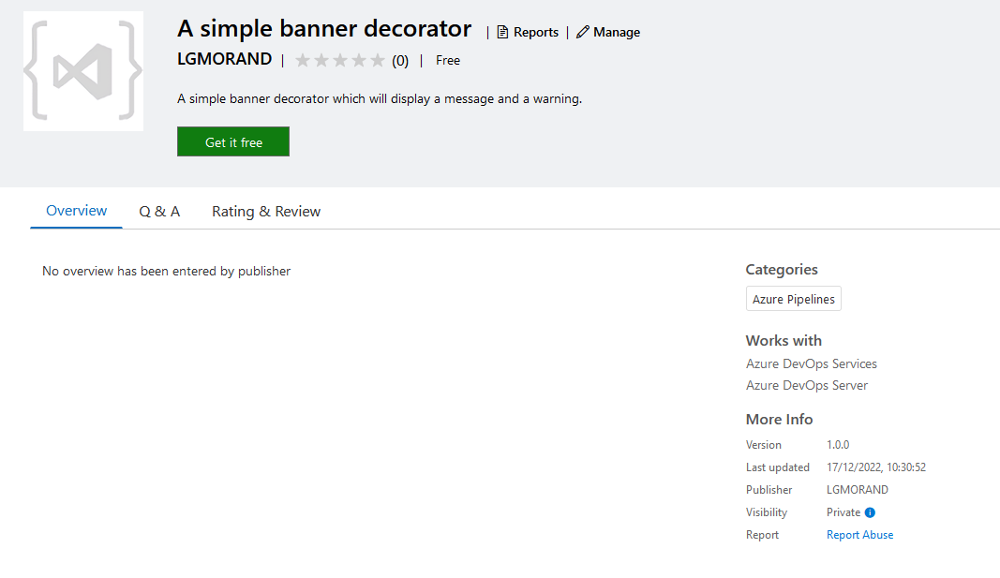
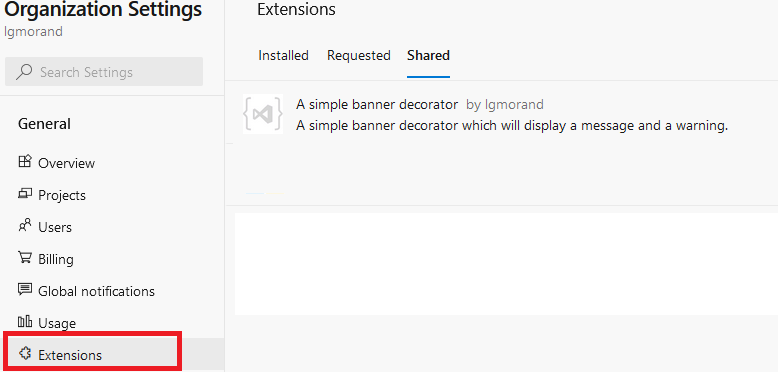
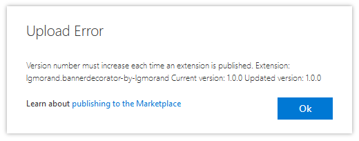
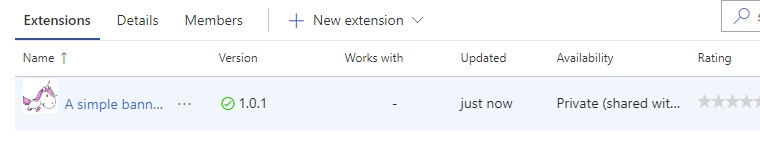
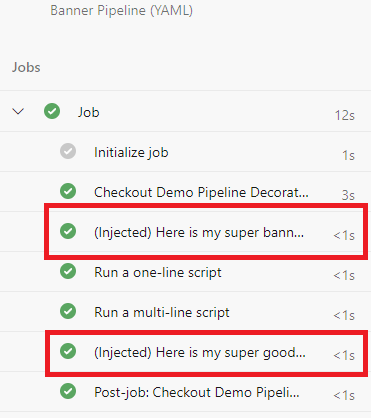

This subject is split into five parts:

- Part 1: [What are pipeline decorators and create your first decorator](https://lgmorand.github.io/blog/azure-devops-pipeline-decorator-part1)
- Part 2: [Deploy your decorator, validate it, and enhance it](https://lgmorand.github.io/blog/azure-devops-pipeline-decorator-part2)
- Part 3: [Create a more advanced decorator: a docker linter](https://lgmorand.github.io/blog/azure-devops-pipeline-decorator-part3)
- Part 4: [Create another advanced decorator: a credentials scanner](https://lgmorand.github.io/blog/azure-devops-pipeline-decorator-part4)
- Part 5: [Tips and tricks](https://lgmorand.github.io/blog/azure-devops-pipeline-decorator-part4)

## Part 2: Deploy your decorator, validate it, and enhance it

### Create a publisher account

Since Azure DevOps Services is a SaaS offering, the only way to customize your organization is to install extensions but these extensions must come from the [Azure DevOps Marketplace](https://marketplace.visualstudio.com/azuredevops). In our case, we need to publish our pipeline decorator on this marketplace (which is an extension) but to do so, we need to release it under a publisher name even if, as we'll see later, nobody except our organization will be able to see/install our extension.

> Publisher account is only required if you plan to install your extension to Azure DevOps Services (SaaS version). On Azure DevOps Server (on-premises), the standalone VSIX file is sufficient.

For that, go to the [management portal](https://marketplace.visualstudio.com/manage) which should ask you to create your publisher account. Be aware that the  user with whom you create the publisher account is important, as this account would also need to be an administrator of your Azure DevOps organization

> During the creation of my publisher, I discovered that my ID was used already. The existing publisher was created using another account when I was younger. I tried to delete the existing publisher without success until I discovered a proper solution which I [documented here](https://lgmorand.github.io/blog/delete-publisher).

### Upload your extension

It's now time to upload our extension on the marketplace. For that, you need:

- the generated extension (*.vsix)
- ensuring the ID contained in its manifest (vss-extension.json) matches exactly the name of the publisher account you just created


Once the extension is uploaded and validated, you can check the result by opening the contextual menu (...) and choosing "*View extension*" to see the final page of your extension. That is what a user would see if your extension was public:



We still need to make it available from our org. To do so, from the context menu, click on "*Share/Unshare*" to open a side panel where you can type the name of organizations you want your extension to be available:


Now, go back to your Azure DevOps organization. Once there, open the *Organization settings* screen and then the *extensions* tab. This screen shows the **Installed** extensions, the **Requested** extensions which are the extensions users without enough rights tried to add to the organization and the **Shared** extensions. That is in this last screen that you should now see your custom decorator.



This only means that the extension is available but does not mean it is installed yet. You must now click on the extension and select "*Install*" to effectively install it on your organization.

### Time to check that the decorator is working

This part is the easiest one. We added no specific conditions to our manifest except that it should run for any pipeline (classic or YAML) by using the property *ms.azure-pipelines-agent-job.pre-job-tasks*.

Run any of your pipelines and check for the result.

### Enhance our decorator

A decorator is injected implicitly in any pipeline run, and it could surprise the users to see that something has been added to their pipeline but they can't explain where it comes from. We are going to improve it using diverse ways:

- add an icon to brand your decorator
- add a readme-like experience that provides information regarding your decorator
- a hint in its title
- a log message

First, we need to help our users that the injected steps are not here accidentally or by their hand. I like to add "(injected)" in the title of the steps as a hint.

```yaml
steps:
  - task: CmdLine@2
    displayName: '(Injected) Here is my super banner'
```

And you could also add a simple log message with your decorator YAML file.

```bash
echo "This step is automatically injected in your workflow as part of the governance of the company"
```

A second quick win is to add an icon to your extension which will make it more recognizable. In the folder of your decorator, add a folder named "images" et put an image in PNG format (size should 128 x 128 pixels). Then reference this icon in the *vss-extension.json* by adding:

```json
"icons": {
        "default": "images/extension-icon.png"        
},
```

Add an overview

If you try to repackage your decorator and try to upload it to the portal, you will get an error message:



It means that you must increment the version inside the manifest (vss-extension.json).

Take few seconds to increase the number of the property *version*. Your final file should be something like this (the YAML file banner-decorator.yml remains unchanged):

```json
{
    "manifestVersion": 1,
    "id": "bannerdecorator-by-lgmorand",
    "name": "A simple banner decorator",
    "version": "1.0.1",
    "publisher": "lgmorand",
    "targets": [
        {
            "id": "Microsoft.VisualStudio.Services"
        }
    ],    
    "description": "A simple banner decorator which will display a message and a warning.",
    "categories": [
        "Azure Pipelines"
    ],
    "icons": {
        "default": "images/extension-icon.png"        
    },
    "contributions": [
        {
            "id": "my-injected-banner",
            "type": "ms.azure-pipelines.pipeline-decorator",
            "targets": [
                "ms.azure-pipelines-agent-job.pre-job-tasks"
            ],
            "properties": {
                "template": "banner-decorator.yml"
            }
        }
    ],
    "files": [
        {
            "path": "banner-decorator.yml",
            "addressable": true,
            "contentType": "text/plain"
        }
    ]
}
```

You can also use the --rev-version parameter which will increment it for you during packaging:

```bash
tfx extenstion create --rev-version
```



If you go back to your organization, you will note that the extension has been automatically updated to the last version; you don't need to reinstall it.

We can now enrich our decorator to output a second message at the end of the workflow without creating a second decorator. For that, you just need to add another *contribution* with a *post-job* target and optionally use a different YAML file. The conditions would look like this:

```json
"contributions": [
        {
            "id": "my-injected-banner",
            "type": "ms.azure-pipelines.pipeline-decorator",
            "targets": [
                "ms.azure-pipelines-agent-job.pre-job-tasks"
            ],
            "properties": {
                "template": "banner-decorator.yml"
            }
        },
        {
            "id": "my-second-injected-banner",
            "type": "ms.azure-pipelines.pipeline-decorator",
            "targets": [
                "ms.azure-pipelines-agent-job.post-job-tasks"
            ],
            "properties": {
                "template": "byebye.yml"
            }
        }
    ]
```

And the result, once injected into a workflow, should look like this:



> *Source code:* the source of [this decorator can be downloaded here](https://github.com/lgmorand/azure-devops-pipeline-decorators/tree/main/src/banner-decorator).

In the [next part of this guide](https://lgmorand.github.io/blog/azure-devops-pipeline-decorator-part3), we will build a more realistic decorator.
