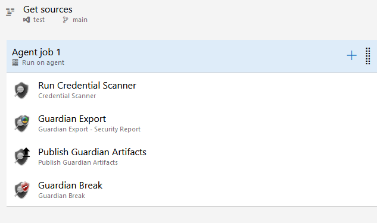
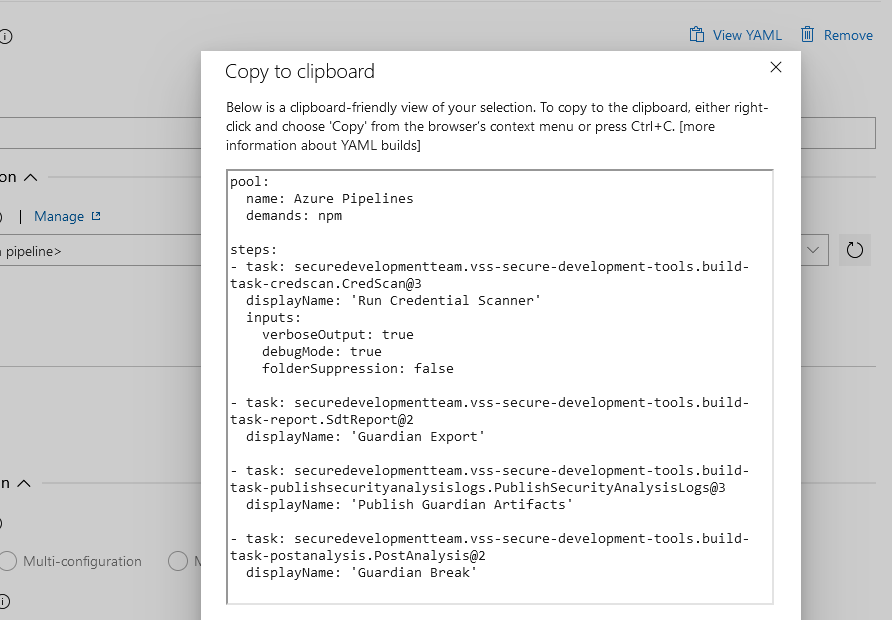
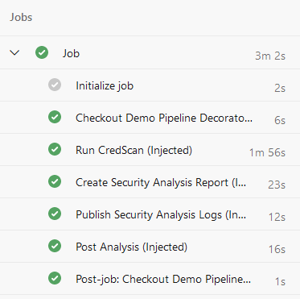
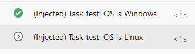

This subject is split into five parts:

- Part 1: [What are pipeline decorators and create your first decorator](https://lgmorand.github.io/blog/azure-devops-pipeline-decorator-part1)
- Part 2: [Deploy your decorator, validate it, and enhance it](https://lgmorand.github.io/blog/azure-devops-pipeline-decorator-part2)
- Part 3: [Create a more advanced decorator: a docker linter](https://lgmorand.github.io/blog/azure-devops-pipeline-decorator-part3)
- Part 4: [Create another advanced decorator: a credentials scanner](https://lgmorand.github.io/blog/azure-devops-pipeline-decorator-part4)
- Part 5: [Tips and tricks](https://lgmorand.github.io/blog/azure-devops-pipeline-decorator-part4)

## Part 4: Create a smart credential scanner

For this last decorator, we are going to inject another security tool in the pipeline, but only if the tool is not already present in the workflow. Furthermore, we will need to do more than injecting command lines.

> Important: This extension is private and not listed on the public Azure DevOps marketplace. Don't look for it. Nevertheless, I choose it because it matches perfectly what I'm willing to show.

### Specify what we want to scan and how

This extension contains a dozen of security tools, and each pipeline may require different tasks depending on what you want to scan or perform. In my case, I need:

- a task to scan the files to search for credentials
- a task to transform the results in a standard SARIF file
- a task to upload the SARIF file as an artifact
- a task to stop the workflow if credentials are found

In a classic workflow, it looks like this:



We want to create a decorator which inject the same four tasks, but we need to get their internal names first. To get the name of a task, you can either create a dummy YAML pipeline or you can create a dummy classic pipeline. Once configured, click on "View yaml" button, and you obtain the generated YAML which contains exactly what you want to put in your decorator.



Once we got the task's name for every one of them, we can build my decorator YAML file, which will inject these four tasks whenever the task "Run Credential scanner" is **not** found:

```yaml
steps:
- ${{ if not(containsValue(job.steps.*.task.id, 'ea576cd4-c61f-48f8-97e7-a3cb07b90a6f')) }}:
  - task: securedevelopmentteam.vss-secure-development-tools.build-task-credscan.CredScan@3
    displayName: 'Run CredScan (Injected)'
    inputs:
      debugMode: false
  - task: securedevelopmentteam.vss-secure-development-tools.build-task-report.SdtReport@2
    displayName: 'Create Security Analysis Report (Injected)'
    inputs:
      CredScan: true
  - task: securedevelopmentteam.vss-secure-development-tools.build-task-publishsecurityanalysislogs.PublishSecurityAnalysisLogs@3
    displayName: 'Publish Security Analysis Logs (Injected)'
    inputs:
      AllTools: false
      CredScan: true
  - task: securedevelopmentteam.vss-secure-development-tools.build-task-postanalysis.PostAnalysis@2
    displayName: 'Post Analysis (Injected)'
    inputs:
      CredScan: true
```

Finally, we need to create the vss-extension file:

```json
"contributions": [
        {
            "id": "credscan-decorator",
            "type": "ms.azure-pipelines.pipeline-decorator",
            "targets": [
                "ms.azure-pipelines-agent-job.pre-job-tasks"
            ],
            "properties": {
                "template": "credscan-decorator.yml"
            }
        }
    ],
    "files": [
        {
            "path": "credscan-decorator.yml",
            "addressable": true,
            "contentType": "text/plain"
        }
    ]
```

### Make it compatible with all types of workflows

Sadly, if we try our decorator like this, it would only work for YAML pipelines. Indeed, as explained in the documentation, in a classic pipeline, the injection would occur before the checkout task and thus, since source code would not be available yet, the scan would never return any result. That's why, in such case, you must change the target to occur after the checkout **ms.azure-pipelines-agent-job.post-checkout-tasks**.

The final **vss-extension** file would look like this:

```json
{
    "manifestVersion": 1,
    "id": "credscandecorator-by-lgmorand",
    "name": "A credential scanner decorator",
    "version": "1.0.0",
    "publisher": "lgmorand",
    "targets": [
        {
            "id": "Microsoft.VisualStudio.Services"
        }
    ],    
    "description": "A credentials scanner.",
    "categories": [
        "Azure Pipelines"
    ],
    "icons": {
        "default": "images/extension-icon.png"        
    },
    "contributions": [
        {
            "id": "credscan-decorator",
            "type": "ms.azure-pipelines.pipeline-decorator",
            "targets": [
                "ms.azure-pipelines-agent-job.post-checkout-tasks"
            ],
            "properties": {
                "template": "credscan-decorator.yml"
            }
        }
    ],
    "files": [
        {
            "path": "credscan-decorator.yml",
            "addressable": true,
            "contentType": "text/plain"
        }
    ]
}
```

Once packaged, uploaded on the marketplace, and installed on your organization, you just need to run any workflow to test it:



## Part 5: Tips and tricks

Since we were not capable of covering every capability with real decorator examples, here are some useful information.

### Only inject the decorator for a specific project

You may want to inject decorator for specific projects or in the opposite to exclude from specific projects. There are several ways to do so:

```yaml
steps:
- ${{ if eq(resources.repositories['self'].project, '09bbdc2c-51d3-4b05-b97a-0acdc1817cc7') }}:
  - task: anytask
```

For a classic workflow, the name of the "current repo" is different and the reference to the current repository should use *__designer_repo*:

```yaml
steps:
- ${{ if eq(resources.repositories['__designer_repo'].project,'09bbdc2c-51d3-4b05-b97a-0acdc1817cc7') }}:
  - task: anytask
```

Or simply by using *System.TeamProjet* or *System.TeamProjetId* variables:

```yaml
steps:
- ${{ if eq(variables['System.TeamProject'], 'ProjectA')  }}:
  - task: anytask
```

If you want to inject in all projects except a specific one, just inverse the condition:

```yaml
steps:
- ${{ if not(eq(variables['System.TeamProject'], 'ProjectA'))  }}:
  - task: anytask
```

### Do not inject the decorator if a specific variable is present

The following example shows how to *not* inject the decorator if the variable is present and has a value equal to *true*:

```yaml
steps:
- ${{ if ne(variables['skipDecoratorInjection'], 'true')) }}:
  - task: anytask
```

### Do not inject the decorator if a specific task is already present

See part 4 of this guide with the Credential Scanner.

```yaml
steps:
- ${{ if containsValue(job.steps.*.task.id, 'EA576CD4-C61F-48F8-97E7-A3CB07B90A6F') }}::
  - task: anytask
```

### Inject depending on the operating system

This one is a little specific as it cannot be done at the job (top) level because the parsing of decorators happens because an agent is assigned to the run. The test has to be done at the task level:

```yaml
- task: CmdLine@2
  displayName: '(Injected) Task test: OS is Windows'
  condition: eq(variables['Agent.OS'], 'Windows_NT')
  inputs:
    script: |
        echo %AGENT_OS% 

- task: CmdLine@2
  displayName: '(Injected) Task test: OS is Linux'
  condition: eq(variables['Agent.OS'], 'Linux')
  inputs:
    script: |
        echo $AGENT_OS 
```

And the result:



> Note that variables are not called the same way depending on the operating system they are running on. Note also that Agent.OS became AGENT_OS when accessed from within the workflow, [as exlained in the documentation](https://learn.microsoft.com/en-us/azure/devops/pipelines/process/variables?view=azure-devops&tabs=yaml%2Cbatch#environment-variables). It can be tricky.

### Mix conditions

Of course, you can create complex conditions using expressions ([see documentation](https://learn.microsoft.com/en-us/azure/devops/pipelines/process/expressions?WT.mc_id=DOP-MVP-5001511&view=azure-devops)):

```yaml
steps:
- ${{ if or(containsValue(job.steps.*.task.id, 'EA576CD4-C61F-48F8-97E7-A3CB07B90A6F'), variables['skipDecoratorInjection'], 'true')) }}::
  - task: anytask
```

## Conclusion

1. Pipeline decorators are global in the entire AzDO organization. When using Pipeline Decorators, it is important to consider its implications to all the pipelines in the organization and how it could impact existing pipelines
2. Conditional injection is the tricky part to select workflows where you want your decorator to be applied. You may have to use different technique to  narrow to the relevant pipelines
3. Start super explicit (targeting projects for instance) and when confident, enlarge, repackage and redeploy
4. When your organization has several decorators, and they apply to the same workflow, their order cannot be guaranteed!
5. Conditional injecting targeting a specific task can something inject the same decorator several times in the same workflow (i.e. the Docker task). If the decorator is non-blocking
6. Communicate with end-users when you deploy a new decorator, as they may be surprised to see new tasks within their pipelines

I do hope this guide will help you to leverage the power of these wonderful pipeline decorators.

> If you have any remarks or improvements, don't hesitate to contact me by opening an issue on [the repository](https://github.com/lgmorand/azure-devops-pipeline-decorators).

## Useful links

- Develop a pipeline decorator: [https://learn.microsoft.com/en-us/azure/devops/extend/develop/add-pipeline-decorator](https://learn.microsoft.com/en-us/azure/devops/extend/develop/add-pipeline-decorator)
- All the source code of this white paper: [https://github.com/lgmorand/azure-devops-pipeline-decorators](https://github.com/lgmorand/azure-devops-pipeline-decorators)
- All the runs using these decorators: [https://dev.azure.com/lgmorand/Demo%20Pipeline%20Decorators/](https://dev.azure.com/lgmorand/Demo%20Pipeline%20Decorators/)
- Marketplace Azure DevOps: [https://marketplace.visualstudio.com/azuredevops](https://marketplace.visualstudio.com/azuredevops)
- Pipeline decorator expression context: [https://learn.microsoft.com/en-us/azure/devops/extend/develop/pipeline-decorator-context](https://learn.microsoft.com/en-us/azure/devops/extend/develop/pipeline-decorator-context)
- Built-in Azure DevOps tasks (to get their ID in task.json): [https://github.com/microsoft/azure-pipelines-tasks](https://github.com/microsoft/azure-pipelines-tasks)
- Some examples of real decorators [https://github.com/n3wt0n/AzurePipelinesDecoratorSamples/tree/master/Advanced](https://github.com/n3wt0n/AzurePipelinesDecoratorSamples/tree/master/Advanced)
- Deleting a publisher account [https://lgmorand.github.io/blog/delete-publisher](https://lgmorand.github.io/blog/delete-publisher)

## Thanks

To Clémence Lesné, Adrian Mihailescu, Romain Zert and Fethi Dilmi for proofreading this document.
