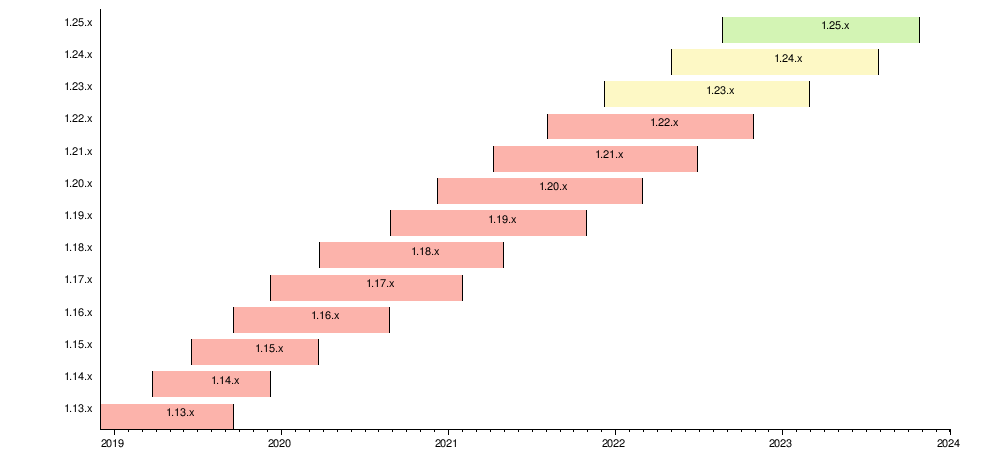

## Introduction

Some people believe that upgrading an AKS cluster only involves upgrading the Kubernetes version. It's a little more complex than that but perfectly logical.

When you install a Kubernetes cluster, you install it on Virtual Machines and you have several layers of components:

- The first one is the operating system itself (Ubuntu, Windows or Mariner on Azure). As with any computer, the OS must be patched on a regular basis
- On top of that system, you will have the Kubernetes components
- But you also have components that are used to form the "AKS version" offering. You'll find things such as the container runtime ([containerd](https://containerd.io/)), some security profiles, some tooling, some configuration for the OS

These are the 3 layers of a worker not and these three layers must be upgraded.


## Kubernetes lifecycle

For several years, the Kubernetes community released a new version every 3 months and the support was limited to the last version + 2 previous ones, which means that you had to upgrade your cluster at the very least once every 9 months. When you have critical workloads or manage dozen of clusters, it can become really difficult to manage all of them.

In consequence, the Kubernetes group did some analysis and discover that the majority of production clusters were out of support due to the complexity to upgrade. They slowed down the release schedule and we now have around three new releases per year. Each release has a twelve months support + a rough two months maintenance extension which gives you 14 months to upgrade each cluster. It's not perfect but it doubles the time that we had before Kubernetes v1.19.



> Note: if you want to know the exact date of the end of support, you can [read the official page](https://kubernetes.io/releases/patch-releases/#support-period).

## AKS lifecycle

On Azure, Microsoft tries to follow the same schedule. To be precise, once a version of Kubernetes is released, a month later, this version is generally available as Preview and a few weeks later as "GA". Once this version is released, (let's say version 1.26), the different versions (1.26.x, 1.25.x and 1.24x) remain supported while version 1.23.x will go out of support after 30 days.

But that's not sufficient. Regarding the patch versions, only two of them are supported. For instance, we would have

| Version  | Supported |
|---|---|
| v1.26.1 | Yes |
| v1.25.5 | Yes |
| v1.25.3 | Yes |
| v1.25.1 | No |
| v1.24.11 | Yes |
| v1.24.9 | Yes|
| v1.24.6 | No |
| v1.24.3 | No |
| v1.24.1 | No |
| v1.23.x | No |

### What's happening when you are in an out-of-support version?

Nothing. The documentation says that Azure may force the upgrade but I've never seen that. It would be too dangerous for Microsoft as they don't know what's running inside the cluster. I saw clusters with version 1.13 while the 1.21 was GA.

The main risk is regarding Azure support. If you create a ticket, the support will first check the version of your cluster. **They won't provide support for any issue if your cluster is out of support**.
What they will do instead, is provide help as best effort to upgrade your cluster to a supported version and then, once done, they will work on your issue.

It's perfectly understandable as the root cause of your issue may be due to a bug/incompability with an old version. So keep in mind that when using Kubernetes, including a managed version, you **must** keep up with supported versions.

## Manual upgrade

The first solution which gives you more control is the manual upgrade. You can decide when and to which version you want to upgrade.

First, you need to list the available upgrade versions for the **desired** cluster.

```cli
az aks get-upgrades --resource-group myResourceGroup --name myAKSCluster --output table
```

> **Upgrade path**: It's critical because the versions are not always available in all Azure regions (at the same time) and there is an upgrade path. For instance, you can't skip a version. You **must** upgrade from version 1.24 to 1.25.x before upgrading to 1.26.
Skipping multiple versions can only be done when upgrading from an unsupported version back to a supported version. For example, an upgrade from an unsupported 1.10.x -> a supported 1.15.x can be completed if available. When performing an upgrade from an unsupported version that skips two or more minor versions, the upgrade is performed without any guarantee of functionality and is excluded from the service-level agreements and limited warranty. If your version is significantly out of date, it's recommended to re-create the cluster.

To upgrade a cluster, a simple command can do the job:

```cli
az aks upgrade \
    --resource-group myResourceGroup \
    --name myAKSCluster \
    --kubernetes-version KUBERNETES_VERSION
```

## Automatic upgrade

> If using the node-image cluster auto-upgrade channel or the NodeImage node image auto-upgrade channel, Linux unattended upgrades will be disabled by default.

## Planned maintenance

## What about deprecated APIs?

Regularly, when a new Kubernetes version is released some resources (CRD) and APIs are marked as deprecated and stop working. These deprecated APIs are listed on [this page](https://kubernetes.io/docs/reference/using-api/deprecation-guide/).

## Conclusion

As you have seen, there are several techniques to manage the lifecycle of your cluster but here is my recommendation:

1. enable cluster auto-upgrade channel using the **patch** channel on all your clusters. You'll be up to date with the last bug & security fixes; while preventing any breaking changes.
2. enable cluster auto-upgrade with the **stable** channel on your dev environment. This way, as soon as a new version is available, you start to use the new version and you have plenty of time to validate that your workloads work fine before upgrading the minor version of the production cluster.
3. Don't forget to enable and customize planned maintenance during Office off-hours. Your workloads may not be disruption-ready, doing so, you are reducing the impact an upgrade could have on them.
4. In a nightly pipeline, in your development environment, use tools such as [Kubent](https://github.com/doitintl/kube-no-trouble) or [Pluto](https://github.com/FairwindsOps/pluto) to detect early deprecated APIs used by the development teams.
5. Have a reporting dashboard listing all your clusters having a soon-not-supported version and plan

Follow these good practices and your life should be easier.
