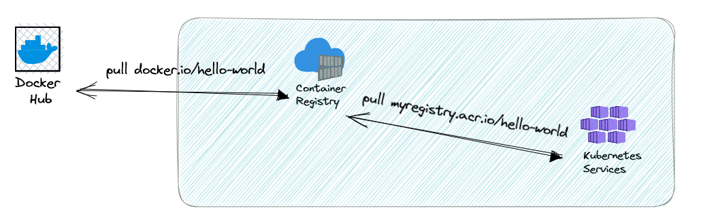
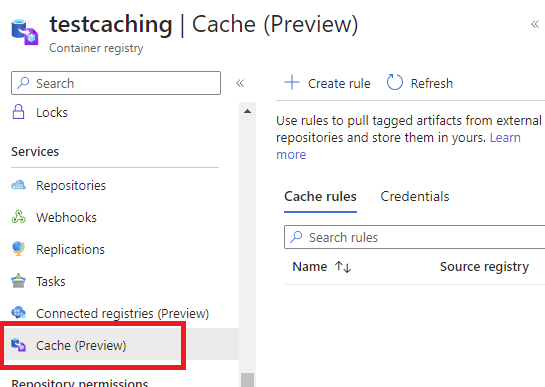
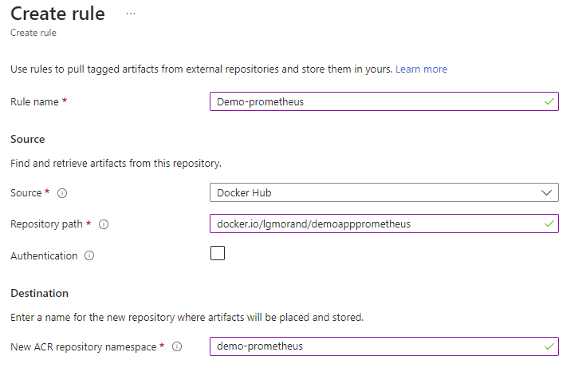
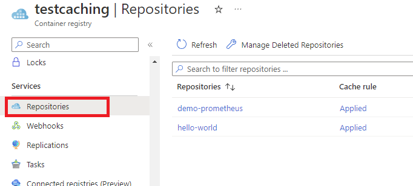
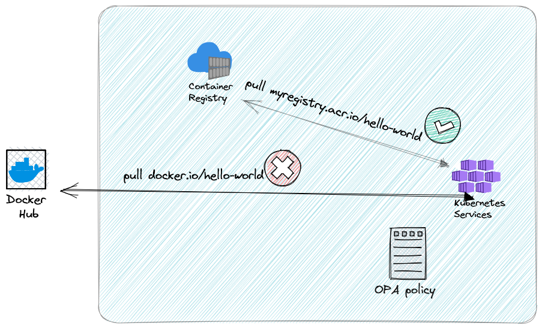

## ACR Caching

A few days ago, Azure released a new [preview feature for Azure Container Registry](https://learn.microsoft.com/en-us/azure/container-registry/tutorial-registry-cache).

When you are deploying containers, they come either from your internal registry with custom container images or from a public docker registry. When your development teams use these public containers it forces your network to allow the connection to the Internet but also allows any container image to be deployed in your environment. You have no way to filter them or control their security.

This feature transforms your Azure Container Registry as a caching proxy. Instead of pulling from an external registry, you query your own ACR and it will be responsible to download and to cache the image for you. But it will only do it for declared images (named `caching rules`).



Adding to the notion of caching and performance, it will allow different scenarios around governance and security (spoiler: but not yet).

## How to use it?

For the moment, you can only enable it and configure it through the Azure Portal but it should quickly come with CLI and infra as code too.

Open your Azure Container Registry and open the `Caching Rules` blade:



From there, you can create up to 50 caching rules, one per container image you'd like to cache. Give a name to your rule, the name of the container image (its URL) and the alias you want to give in your ACR.



Once done, you just need to replace the name of your image with the name of the alias of the caching rule. In my case, *docker.io/lgmorand/demoappprometheus:v1.0* will become *testaching.acr.io/demo-prometheus:v1.0*.

```yaml
apiVersion: v1
kind: Pod
metadata:
  name: demo-prom
spec:
  containers:
    - image: testaching.acr.io/demo-prometheus:v1.0
      ports:
        - containerPort: 80
```

When you deploy your manifest, it will try to pull the image from the ACR. If the image version is not here, then it will download it from the real source (docker.io) before serving it to your cluster.

Only after a first pull, the image will be visible in your ACR repositories:



> Note: Caching for ACR does not automatically pull new versions of images when a new version is available. For every new image available, a new pull request must be complete. It may change in the future.

## Governance

The real value of this feature is that it allows you to put a policy that only allows trusted registries in your clusters. You can use OPA/Gatekeeper and [Azure policies for Kubernetes](https://learn.microsoft.com/en-us/azure/governance/policy/concepts/policy-for-kubernetes).

[One policy in particular](https://github.com/Azure/azure-policy/blob/master/built-in-policies/policyDefinitions/Kubernetes/ContainerAllowedImages.json) only allows image pulls for whitelisted registries.



Until now, when this policy was enabled, when a project team wanted to use a public image, they had to pull the image locally, push it in the registry and then pull it in the Kubernetes cluster. This new feature will simplify this part.

Another aspect of governance, now that we can whitelist a set of Azure Container Registries, is to go a step further with Microsoft Defender for Containers which allows you to scan images for known vulnerabilities when they are first pushed, and whenever they are pulled.

This relies on the following azure policy that denies AKS to create pods/deployments out of vulnerable docker images (scanned by Defender for Cloud).

This extra step in governance is to be performed with extreme care as it sets a strain on application teams to always have safe images. For that, you may use [Azure Defender CI/CD scanning](https://aka.ms/AzureDefenderCICDscanning) and (Azure defender for container registries](https://aka.ms/AzureDefenderForContainerRegistries) to identify and patch vulnerabilities before deployment.

Another aspect to consider is to exclude production environments from the scope of this policy as this may lead AKS not being able to create new replicas of existing deployments (that still rely on a just-identified-but-not-yet-fixed docker image).

## Next steps

Of course, this preview is quite incomplete but it paves the way to something great. For instance, we could have only one place for all container images and we could enable security scanning on it (which is in the roadmap).

## Conclusion

It costs almost nothing (only storage used by imported images) but it brings more control, better performance to pull an image and is the first step for your governance. It should be your default choice.

ps: be careful with [the current limitations](https://learn.microsoft.com/en-us/azure/container-registry/tutorial-registry-cache#preview-limitations), especially the number of caching rules.

## Thanks

Thanks to my colleague Fethi Dilmi for proofreading and completing this post.
