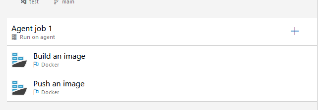
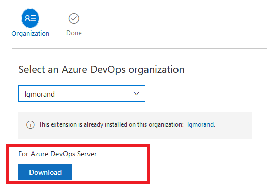

This subject is split into five parts:

- Part 1: [What are pipeline decorators and create your first decorator](https://lgmorand.github.io/blog/azure-devops-pipeline-decorator-part1)
- Part 2: [Deploy your decorator, validate it, and enhance it](https://lgmorand.github.io/blog/azure-devops-pipeline-decorator-part2)
- Part 3: [Create a more advanced decorator: a docker linter](https://lgmorand.github.io/blog/azure-devops-pipeline-decorator-part3)
- Part 4: [Create another advanced decorator: a credentials scanner](https://lgmorand.github.io/blog/azure-devops-pipeline-decorator-part4)
- Part 5: [Tips and tricks](https://lgmorand.github.io/blog/azure-devops-pipeline-decorator-part4)


## Part 3: Create a docker linter

For this second decorator, we would like to build a task responsible for analyzing a Dockerfile and checking that it follows good practices. There are plenty of tools to do like [dockle](https://github.com/goodwithtech/dockle), [hadolint](https://github.com/hadolint/hadolint) and in our case [dockerfilelint](https://github.com/replicatedhq/dockerfilelint) chosen for its simplicity.

### Build our linter task

Technically, we need to create a task which:

- checks if a Dockerfile exists in the source code
- if any file is found, install dockerfileint
- scan any Dockerfile and report the results
- stops the workflow if issues have been found

Our script within our decorator could look like this:

```yml
steps:
  - task: CmdLine@2
    displayName: '(Injected) Docker linter'
    inputs:
      script: |
        
        echo 'looking for DockerFile'
        filePath=$(find -type f -name Dockerfile)
        if [ -z "$filePath" ]
        then
              echo "No Dockerfile was found"
        else
              echo "Dockerfile(s) found: $filePath"

              echo 'installing dockerfilelint'
              npm install -g dockerfilelint --silent
              echo 'Installed version: '
              dockerfilelint -v
              
              echo 'running dockerfilelint'
              find -type f -name 'Dockerfile' -exec dockerfilelint {} \;
              # explanation of find+exec: https://stackoverflow.com/questions/9612090/how-to-loop-through-file-names-returned-by-find

              if echo "$result" | grep -q "None found"; then
                  echo "no issues found"
              else
                  echo "issues found"
                  exit 1 # throw an error to stop the workflow
              fi
        fi
```

Once the YAML file, is ready, we just need to create the vss-extension file:

```json
{
    "manifestVersion": 1,
    "id": "dockerlinter-by-lgmorand",
    "name": "A docker linter decorator",
    "version": "1.0.0",
    "publisher": "lgmorand",
    "targets": [
        {
            "id": "Microsoft.VisualStudio.Services"
        }
    ],    
    "description": "A docker linter based on dockerfilelint.",
    "categories": [
        "Azure Pipelines"
    ],
    "icons": {
        "default": "images/extension-icon.png"        
    },
    "content": {
        "details": {
            "path": "overview.md"
        }
    },
    "contributions": [
        {
            "id": "docker-linter-decorator",
            "type": "ms.azure-pipelines.pipeline-decorator",
            "targets": [
                "ms.azure-pipelines-agent-job.pre-job-tasks"
            ],
            "properties": {
                "template": "docker-linter-decorator.yml",
            }
        }
    ],
    "files": [
        {
            "path": "docker-linter-decorator.yml",
            "addressable": true,
            "contentType": "text/plain"
        }
    ]
}
```

We can now package it, publish it and deploy it to our organization.

### My decorator is injected too often

If we evaluate it, our decorator is working perfectly but it is also injected in all workflows of our organization, including those who don't use Docker technology. This could be an issue as it will increase the time of each pipeline execution (especially if the source code contains numerous files) and if you have several decorators in your organization, each pipeline could get polluted by irrelevant decorators.

We need to find a way to target only pipelines which are using Dockerfile. We could restrict the decorator to run for specific projects by adding a condition, but it would require to hard-code the GUID of each project like this (there are [other ways to filter by project](#part-5-tips-and-tricks)):

```yaml
steps:
- ${{ if eq(resources.repositories['self'].project, '123455-2492-6524-9851-564526e8fc8')
```

Another way of doing it is to target the presence of specific tasks in the pipelines. In our case, we want to analyze any Dockerfile with the tool *dockerfilelint* before we really use the file to build a Docker image. We just need to find pipelines where we use the Docker file. The simplest way to do it is to target pipelines which contain the built-in Docker task:



In our case, the ID of the Docker task is: "e28912f1-0114-4464-802a-a3a35437fd16"

> To find the ID of a task, you can either check [this repository](https://github.com/microsoft/azure-pipelines-tasks/tree/master/Tasks) if the task is a built-in task, and open the task.json file. If the task is a custom task from the marketplace, you just need to download its VSIX file and unzip it to find the task.json file. To obtain the VSIX from a custom task, just go on the marketplace and try to install it. Instead of installing it on your organization, choose the Azure DevOps Server option and download the file:


Once we have the task's ID, we need to alter the target of our decorator to say, "inject it before each occurrence of a specific task" and we can do it using the target **ms.azure-pipelines-agent-job.pre-task-tasks** and by adding the property *targettask* with the GUID of our task.

Our final vss-extension file looks like this:

```json
"contributions": [
    {
        "id": "docker-linter-decorator",
        "type": "ms.azure-pipelines.pipeline-decorator",
        "targets": [
            "ms.azure-pipelines-agent-job.pre-task-tasks"
        ],
        "properties": {
            "template": "docker-linter-decorator.yml",
            "targettask": "e28912f1-0114-4464-802a-a3a35437fd16"
        }
    }
],
```

> Note: if the users use directly the *docker* command within a script or a simple CmdLine task, our decorator would not work as we can't parse the pipeline file to detect a keyword. There is no solution that I'm aware of for such use case.

Let's package a new version of our decorator and deploy it. If we run any workflow which uses the Docker task, then our decorator is injected as seen in [this example](https://dev.azure.com/lgmorand/Demo%20Pipeline%20Decorators/_build/results?buildId=3181&view=logs&j=275f1d19-1bd8-5591-b06b-07d489ea915a) :


It's not perfect but it does the job and injecting a decorator before specific tasks is very useful to target specific workflows.

In the [last part of this guide](https://lgmorand.github.io/blog/azure-devops-pipeline-decorator-part4), we will build a more complex  decorator and see some tips.
